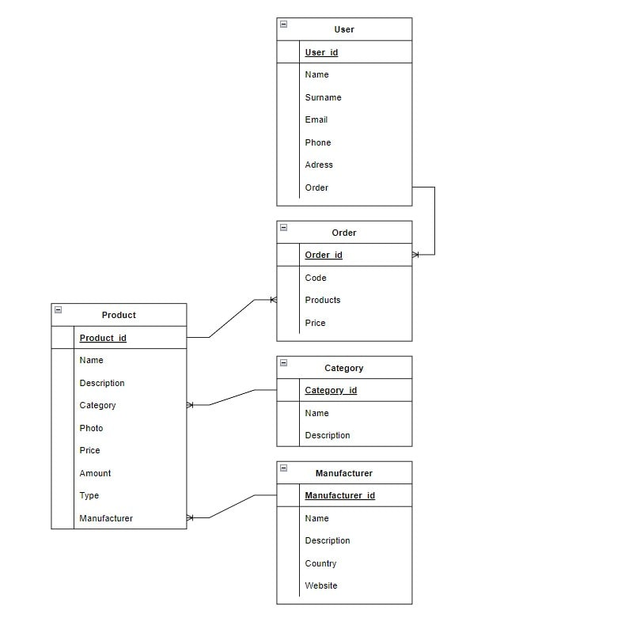

# ANTONIOREST
___
Технічне завдання полягало в проектуванні та розробці бази даних для системи продуктового магазину, яка могла б надавати інформаційні послуги для публікації та оновлення необхідних даних. Ця база даних включала б інформацію про користувачів та їх замовлення, виробників, товари та їх категорії, а також можливість пошуку та відбору даних. Відповідно до предметної області, система була розроблена з урахуванням таких особливостей
+	Кожен товар представлений у своїй категорії.
+	Для кожного товару ви отримаєте інформацію про виробника, ціну, назву, категорію та залишок на складі.До товарів так само додаються індивідуальні описи та фотографії. 
+	Кожен виробник може мати кілька типів товарів.
+	У замовленні можна обирати декілька товарів. Інформація про замовлення містить номер замовлення та його ціну.

